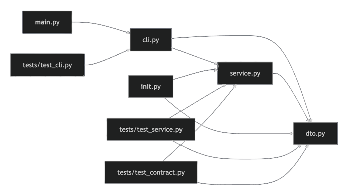

# PrintHelloWorld

Репозиторий демонстрирует, что даже `Hello, World!` можно довести до уровня, где на него уже страшно смотреть без архитектурной диаграммы.

## Зачем это

Проект сделан как ироничный пример «сверхдисциплины»:

- есть чёткое разделение слоёв (`dto -> service -> cli`);
- есть строгая типизация (`mypy strict`);
- есть линтинг и форматирование (`ruff`);
- есть тесты с высоким порогом покрытия (`pytest + coverage >= 95%`);
- есть единая локальная точка контроля качества (`pre-commit run --all-files`).

## Быстрый старт (uv)

```bash
uv sync --group dev
```

Если `uv` не установлен:

```bash
python -m pip install -e ".[dev]"
```

Запуск через установленный скрипт:

```bash
uv run print-hello-world --name Nikita --times 2 --punctuation "?"
```

Запуск как модуль:

```bash
uv run python -m print_hello_world --name Team
```

## CLI параметры

- `--name` (default: `World`) - имя для приветствия.
- `--times` (default: `1`) - количество повторов, минимум `1`.
- `--punctuation` (default: `!`) - допустимые значения: `!`, `.`, `?`.

## Quality Gates

Проверка линтера:

```bash
uv run ruff check .
```

Проверка форматирования:

```bash
uv run ruff format --check .
```

Проверка типизации:

```bash
uv run mypy src tests
```

Тесты и покрытие:

```bash
uv run pytest
```

Единая полная проверка:

```bash
pre-commit run --all-files
```

## Архитектура

Структура пакета:

- `dto.py` - межслойные структуры данных (`GreetingRequest`, `GreetingResponse`);
- `service.py` - доменная логика и валидация (`build_greeting`);
- `cli.py` - адаптер командной строки;
- `__main__.py` - запуск `python -m print_hello_world`.

Диаграмма ниже отражает фактические импорт-зависимости модулей в текущей версии:



Ключевые принципы:

- без циклических импортов;
- доменная логика не зависит от CLI;
- DTO используются как явный контракт между слоями;
- строгая типизация и тесты фиксируют ожидаемое поведение.

## Почему это полезно

Когда проект начнёт расти (например, появится сборка приложения или дополнительные адаптеры), текущая структура уже готова к расширению без переписывания «с нуля».
